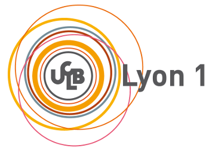

# MIF08-labs
Public files for LYON1-FST M1 students (MIF08 course)




[Official Website for MIF08 (where to find labs subjects)](http://laure.gonnord.org/pro/teaching/compilM1.html)

[La page de l'avancée du cours (fr)](./AVANCEE.md)

# Get the repository

```
git clone https://github.com/lauregonnord/mif08-labs18.git
cd mif08-labs18
```

# Contents

   * target18/ : the target machine for the 2018-19 compiler. 

   * TPxx/     : student companion files for MIF labs 2018-19.


# About the target machine

The target machine is the output of the ASR course, ENSL, 2017-18.
The directory contains the assembly, the emulator, and some test
programs, (nearly) as they where delivered by the students as output to
their ASR project.
**Warning,** the accurate documentation is on the course webpage

# Contact

Laure Gonnord, Université Lyon 1, LIP [email](mailto:laure.gonnord@univ-lyon1.fr)

# Contributors

  * Labs (ENSL 2018 version): Laure Gonnord, Matthieu Moy, Rémy
    Grünblatt, ...
  
  * Target18 spec, assembly and emulator (ASR, ENSL, 2017-18): Florent
  Dupont de Dinechin (<florent.de-dinechin@insa-lyon.fr>), Antonin
  Dudermel <antonin.dudermel@ens-lyon.fr>, Maxime Darrin
  <maxime.darrin@ens-lyon.fr>, Sébastien Michelland
  <sebastien.michelland@ens-lyon.fr>, Reynaud Alban <alban.reynaud@ens-lyon.fr> 
